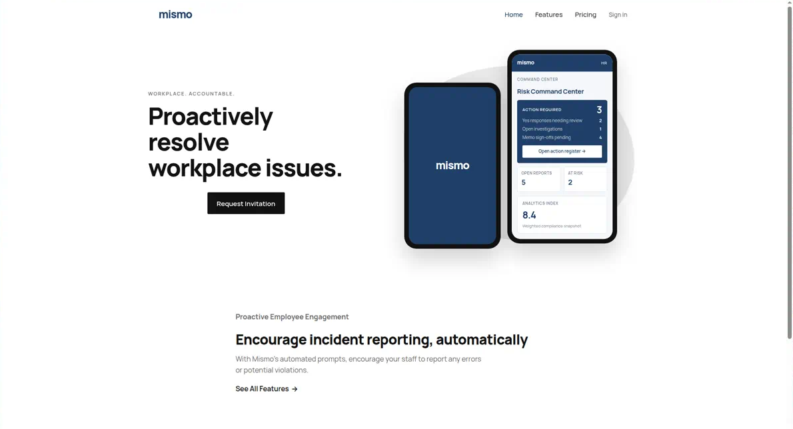
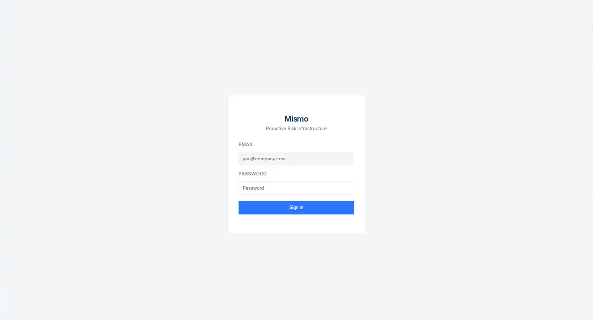
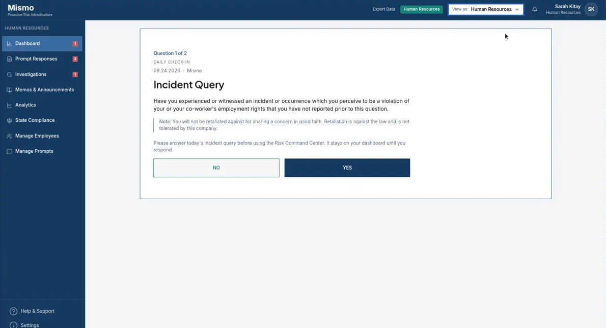
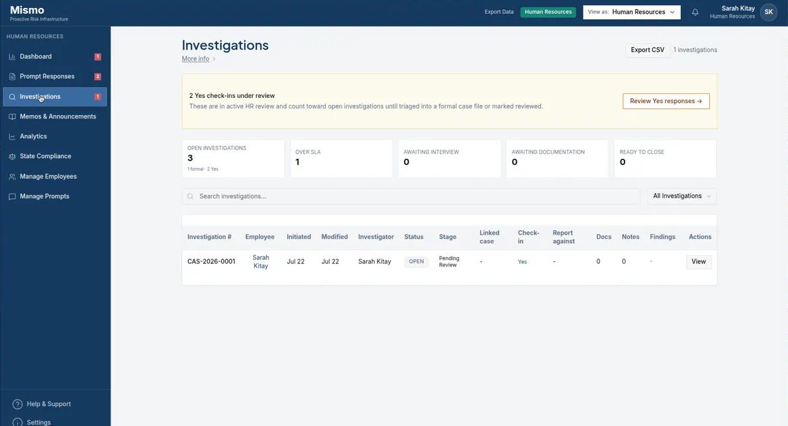

# Mismo

Multi-tenant HR and compliance sample: org-scoped daily check-ins, workplace and wage-hour reports, a case register, investigations, memos, and admin tools.

Tenant isolation is Postgres row-level security. The Edge API requires a project JWT (`verify_jwt = true` on `mismo-api`) and re-binds that JWT to `public.users`, so a client-supplied `orgId` is ignored. This repository is a **sanitized public demo** — application code, SQL, and tests, not production customer data.

**Live:** [mismo-theta.vercel.app](https://mismo-theta.vercel.app) (marketing) · [mismo-app.vercel.app](https://mismo-app.vercel.app) (sign-in)

Screenshots from the public demo on 24 Sep 2026. Signed-in views are the demo HR user in organization Mismo. That day's incident check-in gates the case register until it is answered; the investigations list stays reachable.

| | |
| --- | --- |
|  |  |
|  |  |

## What the public code demonstrates

| Concern | Where to look | How it is tested |
|---------|---------------|------------------|
| Tenant isolation | `docs/database/04_rls_policies.sql`, `11_rls_claims_fallback.sql`, [`docs/THREAT_MODEL.md`](docs/THREAT_MODEL.md) | `tests/rls-sql.test.ts`, `tests/integration/cross-tenant-rls.test.ts` |
| Report RBAC (employee vs HR) | `docs/database/10_reports_rls_split.sql`, `src/lib/authz/policy.ts` | `tests/authz-policy.test.ts` |
| API auth (JWT + in-function RBAC) | `supabase/config.toml`, `supabase/functions/_shared/auth.ts`, `src/lib/authz/routes.ts` | `tests/edge-route-auth.test.ts` |
| Fail-closed case writes | `src/hooks/useDataStore.ts`, `src/lib/supabase/writeOrgData.ts` | `tests/persist-fail-closed.test.ts` |
| Case IDs, register counts, law publish gate | `src/lib/caseReference.ts`, `investigationWorkload.ts`, `lawCorpusFreshness.ts` | `tests/compliance-contracts.test.ts` |

Architecture write-up: [`docs/ARCHITECTURE.md`](docs/ARCHITECTURE.md). Deploy path (Vercel, Edge Functions, migrations): [`docs/DEPLOY.md`](docs/DEPLOY.md).

## Stack

- **App:** Vite, React, TypeScript (`src/`)
- **Auth / data:** Supabase Auth + Postgres RLS (`docs/database/`)
- **Server:** Supabase Edge Functions (`supabase/functions/mismo-api`, `mismo-cron`)
- **Optional AI:** OpenAI called only from Edge Functions (`services/api` is a legacy local stand-in)

The UI uses a small Radix/shadcn set (dialog, select, tabs, and similar primitives actually imported by product pages). Authorization and isolation live in SQL and Edge Functions, not in those UI packages.

## Auth note (reviewers)

`mismo-api` sets **`verify_jwt = true`**. Requests without a valid project JWT never reach handler code.

`mismo-cron` sets **`verify_jwt = false`** because scheduled callers cannot send a user JWT. That function only runs prompt reminders and **requires `CRON_SECRET`**. User-facing routes are not registered there.

After the gateway check, mutating `mismo-api` routes call `authorizeCaller()`, which binds the JWT to `public.users` (org + role) and ignores client-supplied `orgId`.

## Scripts

```bash
npm install
npm test          # contracts plus two-org Postgres RLS (throwaway DB)
npm run build
npm run lint
npm run dev
```

Demo bootstrap (local only, not production data):

```bash
npm run demo:provision-auth
npm run demo:bootstrap
```

CI starts a throwaway Postgres and runs `npm test`, including `tests/integration/cross-tenant-rls.test.ts`. Locally the same tests use `DATABASE_URL` if set, otherwise a disposable `mismo_rls_test` database on the machine Postgres. Never point them at production.

## Security

Access control, tenant isolation, auditability, and human review are product requirements. Report security concerns privately rather than as public issues.

## Ownership

Product architecture and engineering led by Sarah Kitay.

## Layout

```
src/                  Product UI + client data store (domain logic in src/lib + src/hooks)
src/lib/authz/        RBAC + route catalog used by tests
supabase/functions/   Edge API (JWT) and cron (secret)
supabase/migrations/  Ordered copies of docs/database SQL
docs/database/        Schema + RLS (source of tenant isolation)
docs/ARCHITECTURE.md  Request path and trust boundaries
docs/DEPLOY.md        Vercel, functions, and how to apply SQL
docs/THREAT_MODEL.md  Tenant boundary and what RLS does not cover
docs/design/          Copy/UI token notes
docs/archive/         Historical blueprints (not current RLS)
marketing/            Public marketing site
tests/                Automated contracts (`npm test`)
```
