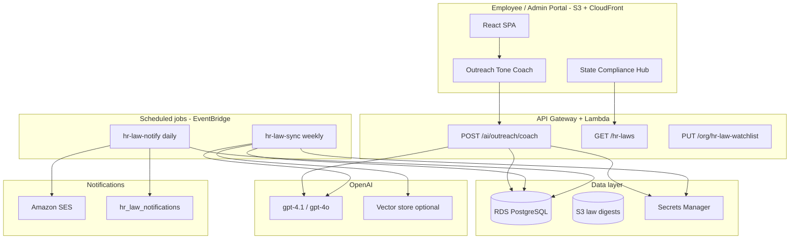

# OpenAI HR Assistant — Architecture

Mismo uses **OpenAI on the server only** (AWS Lambda) for two capabilities:

1. **State HR law monitor** — research, store, diff, and notify when laws change  
2. **Outreach tone coach** — score HR outreach drafts from empathetic → harsh and suggest safer wording

> **Not legal advice.** All AI output is labeled as informational. HR retains final judgment.

---

## System overview



---

## 1. State HR law research & updates

### Goal

Keep a **per-state corpus** of employment-law summaries (wage/hour, leave, harassment, retaliation, etc.), refresh on a schedule, detect changes, and **alert subscribed admins**.

### Sync pipeline (`HR_LAW_SYNC` job)

| Step | Action |
|------|--------|
| 1 | Load `org_hr_law_watchlists` → union of `state_codes` + `topics` |
| 2 | For each state, call OpenAI with structured output (see `services/api/src/prompts/hr-law-research.ts`) |
| 3 | Require **citations + source URLs** (DOL, state labor agencies, official statutes) |
| 4 | Hash canonical `summary` → compare to `hr_law_records.content_hash` |
| 5 | On change → insert `hr_law_updates`, mark old row `is_current = false` |
| 6 | Queue `hr_law_notifications` + SES email to `notify_emails` |

### Recommended schedule

| Job | Cron (UTC) | Purpose |
|-----|------------|---------|
| `hr-law-sync` | `0 6 * * 1` (Mon 6am) | Full research pass for watched states |
| `hr-law-notify` | `0 14 * * *` (daily 2pm) | Send pending emails + in-app alerts |

### OpenAI configuration

- **Model:** `gpt-4.1` or `gpt-4o` with `response_format: json_schema`  
- **Temperature:** `0.2` (factual research)  
- **Tools (optional):** web search / browsing if enabled on your OpenAI project  
- **RAG (phase 2):** upload `full_text` to OpenAI Vector Store; attach to coach + compliance Q&A  

### Training vs. research

We do **not** fine-tune on case data (PII risk). Instead:

- **System prompts** encode Mismo compliance tone and citation requirements  
- **Version prompts** in git (`prompt_version` on `ai_job_runs`)  
- **Ground truth** lives in Postgres (`hr_law_records`), not the model weights  

---

## 2. Outreach tone coach

### Goal

When HR drafts outreach for a case (email/SMS reminder), AI:

1. Rates tone on a **1–6 scale** (empathetic → harsh)  
2. Flags **retaliation**, **coercion**, or **over-promising** language  
3. Suggests a **revised draft** aligned to case type + applicable state laws  
4. Stores session in `outreach_coach_sessions` for audit  

### Tone scale

| Score | Label | Typical use |
|-------|-------|-------------|
| 1 | Empathetic | Sensitive investigations, trauma-informed outreach |
| 2 | Professional | Default HR correspondence |
| 3 | Neutral | Factual requests for info |
| 4 | Direct | Clear deadlines, documented follow-ups |
| 5 | Firm | Repeated non-response, policy enforcement |
| 6 | Harsh | **Discouraged** — flagged as legal/reputation risk |

Target for most case outreach: **2–4**. Scores **5–6** require explicit HR acknowledgment in UI.

### API contract

See `src/types/aiServices.ts` and `POST /ai/outreach/coach` in `services/api`.

### UI integration

- `OutreachToneCoach` panel inside `OutreachReminderModal`  
- Uses `src/lib/api/aiServices.ts` → API Gateway in production, mock in local dev  

---

## Security & compliance

| Rule | Implementation |
|------|----------------|
| API key never in browser | `OPENAI_API_KEY` only in Secrets Manager → Lambda env |
| Org isolation | All queries scoped by `org_id`; RLS on tenant tables |
| Audit | Every call → `ai_job_runs` with tokens, latency, model |
| PII minimization | Coach sends case category + state, not full employee narrative unless required |
| Human review | Suggested text is **draft only**; send button stays with HR |

---

## Environment variables

See root [`.env.example`](../.env.example). Frontend gets only:

```
VITE_API_BASE_URL=https://api.your-domain.com
VITE_AI_FEATURES_ENABLED=true
```

Backend (Lambda) gets OpenAI + RDS from Secrets Manager.

---

## Implementation checklist

- [ ] Apply `docs/AWS_RDS_AI_LAWS_MIGRATION.sql` on RDS  
- [ ] Deploy `infra/template.yaml` (SAM)  
- [ ] Store `OPENAI_API_KEY` in Secrets Manager  
- [ ] Configure org watchlist (states + notification emails)  
- [ ] Enable `VITE_AI_FEATURES_ENABLED` after API is live  
- [ ] Legal review of disclaimer copy on coach + compliance pages  
- [ ] Phase 2: Vector store + admin “ask about CA wage law” chat  

---

## Related files

| Path | Purpose |
|------|---------|
| `docs/AWS_PLATFORM_ARCHITECTURE.md` | Full AWS stack |
| `docs/AWS_RDS_AI_LAWS_MIGRATION.sql` | Database tables |
| `services/api/` | Lambda handlers + OpenAI client |
| `infra/template.yaml` | SAM / CloudFormation |
| `src/types/aiServices.ts` | Shared TypeScript types |
| `src/lib/api/aiServices.ts` | Frontend API client |
| `src/components/admin/OutreachToneCoach.tsx` | Tone coach UI |
